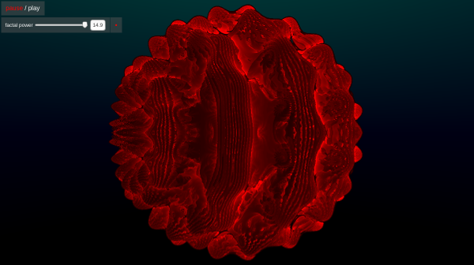

# Ray Tracing Fractals

Website link to project below :

https://jacobdalrymple.github.io/Ray-Tracing-Fractals-with-WebGL/

 

This project uses the technique of ray marching to produce an animated 3D render of the Mandelbulb, along with some UI to control various parameters of the Mandelbulb yourself.

Project has only been extensively tested in Firefox and Chrome browsers.

Equation of the distance estimator of the Mandelbulb taken from:
http://blog.hvidtfeldts.net/index.php/2011/09/distance-estimated-3d-fractals-v-the-mandelbulb-different-de-approximations/